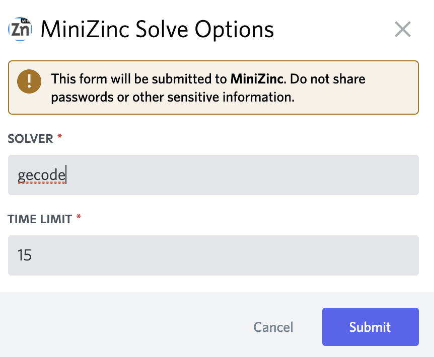

# The MiniZinc Discord Bot

This repository contains the MiniZinc discord bot.
When given a MiniZinc instance in a message, this bot will run the instance, and will send a message with the result.

## Usage

The MiniZinc Discord bot operates on MiniZinc instances (or fragments) contained in a Discord message.
For example, the following message could be used by the bot.

> \`\`\`
>
> include "all_different.mzn";
>
> array[1..3] of var 1..3: x;
>
> constraint all_different(x);
>
> output ["\\([x[i] + 1 | i in 1..3])"]
>
> \`\`\`

Note that the bot will ignore the backticks (e.g., \` or \`\`\`) in the message, allowing the user to use preformatted text.

After you've sent a message to a channel where the bot is active, you can then right-click the message to find the actions the bot can perform in the context menu.


### Options

Whether you click “Flatten MiniZinc” or “Solve MiniZinc” this will open a small screen that allows you to select the target solver and the maximal amount of time that is used before the bot will give up.



By default, the MiniZinc Discord bot will use the `gecode` solver to solve, and a special `stdlib` option to compile with just the MiniZinc library (without a solver library). 
The MiniZinc image by default additionally `cbc` and `chuffed`.

If you want to change the time limit that is given to the MiniZinc compiler and the solver, then you can change the time limit option.
Note that the time limit can never exceed 30 seconds.

### Solving

When using the “Solve MiniZinc” action, then the bot will reply something like the following message in the channel.

> Gecode, version 6.3.0, reported `SATISFIED` in 0.115s:
>
> ```[4, 3, 2]```

### Flattening

When using the “Flatten MiniZinc” action, then the bot will reply something like the following message in the channel.

> Using the definitions of the MiniZinc standard library, version 2.6.4, this results in the following FlatZinc:
>
> ```
> array [1..2] of int: X_INTRODUCED_3_ = [1,-1];
> var 1..3: X_INTRODUCED_0_;
> var 1..3: X_INTRODUCED_1_;
> var 1..3: X_INTRODUCED_2_;
> array [1..3] of var int: x:: output_array([1..3]) = [X_INTRODUCED_0_,X_INTRODUCED_1_,X_INTRODUCED_2_];
> constraint int_lin_ne(X_INTRODUCED_3_,[X_INTRODUCED_0_,X_INTRODUCED_1_],0);
> constraint int_lin_ne(X_INTRODUCED_3_,[X_INTRODUCED_0_,X_INTRODUCED_2_],0);
> constraint int_lin_ne(X_INTRODUCED_3_,[X_INTRODUCED_1_,X_INTRODUCED_2_],0);
> solve  satisfy;
> ```

### Version

To ensure that you are on the same MiniZinc version as the bot, you can run the `/mzn version` command.
The bot will reply to the command with the output of `minizinc --version`.
The command has an optional argument `announce`, when this is set to `True` then the bot sends a message to everyone in the channel, instead of only to you.